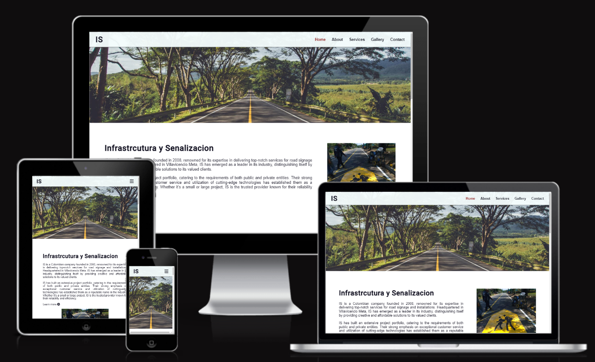

# Infraestructura y Senalizacion
Infrastrucura y Sevilizacion is a real engineering services company that operates in Colombia. The company provides road signage serviices including and not limited to road paint, installation of vertical signage and installation of road safety devices. 

The intent of the website is to increase the company's exposure to new potential clients and to create a more "transparent of the company. 

The Infrastructura y Senalizacion website is live, to access it click [here](https://juanovt10.github.io/seprocivilCO/).

## Table of Content

+ [UX](#ux "UX")
  + [Site Purpose](#site_purpose "Site Purpose")
  + [Site Goal](#site_goal "Site Goal")
  + [Audience](#audience "Audience")
  + [Communication](#communication "Communication")
  + [Current User Goals](#current_user_goals "Current User Goals")
  + [New User Goals](#new_user_goals "New User Goals")
+ [Design](#design "Design")
  + [Colour Scheme](#colour_scheme "Colour Scheme")
  + [Typography](#typography "Typography")
  + [Imagery](#imagery "Imagery")
+ [Features](#features "Features")
  + [Existing Features](#existing_features "Existing Features")
+ [Testing](#testing "Testing")
  + [Validator Testing](#validator_testing "Validator Testing")
  + [Unfixed Bugs](#unfixed-bugs "Unfixed Bugs")
+ [Technologies Used](#technologies_used "Technologies Used")
  + [Main Languages Used](#main-languages_used "Main Languages Used")
  + [Frameworks, Libraries & Programs Used](#frameworks-libraries-programs-used "Frameworks, Libraries & Programs Used")
+ [Deployment](#deployment "Deployment")
+ [Credits](#credits "Credits")
  + [Content](#content "Content")
  + [Media](#media "Media")

## UX

### Site Purpose: 

Provide information about the road signage company to people interested in consulting or engineering services. 

### Site Goal: 
To provide information about who is the company, including the general information about the company, the services it provides and a gallery of pictures showcasting their work. Additionally, it provides contact information and a form to request a quote or information from the company. 

### Audience: 
The site is design for individuals or businesses that need any sort of horizontal and vertical demarcation, road installations and XXXX. 

### Communication: 

### Current User Goals: 
To keep providing general information about the business to the public. 

### New User Goals: 
- Navigate around the 5 pages of the website to find or search the relevant information they need about the buisenss.
- 

## Design 

### Color Scheme: 

### Typography: 
Lato was used for the body of the elements and it was accompanied by Roboto for the headings. These two fonts help protraying a professional engieering site. 

### Imagery:
All the images excluding the hero image, and background image for the contactus.html and contactus_sent.html pages, where collected directly from the company. The hero image was takeng from a free stock photo platform. 

## Features

### Exisiting features 
#### Navigation bar
The navigation bar is included in all 5 pages and the landing form page to keep the menu in case the user would like to keep navigating the website after form submission. Additionally, the navigation bar is fixed for all pages, this allows the user to access the menu any time it wants.

(link to the screenshot)

Additionally, using online tutorials where credits I provide on the X section, I developed a basic hamburger menud dropdown for when the website is displayed on screens widths ###px or less. 

(link to the screenshot)

#### Home Page
This is a brief brief introduction page for all the other pages in the website. Here you will find the About us introduction section with a brief descritpion of the company and the services it provides. 

(link)

After scrolling you will find the three main types of services the company provides. Here, there is a hovering feature the defines the type of service and provides engagemenet of the user to click and see the main services page. 

(link)

The last section of the home page will provide three main pictures as an introductory gallery pictures where it indicates the city where the project took place and all pictures will be interactive links that will redirect the user to the main gallery page where they can see all the projects' gallery. 

(link)

The footer element for larger screens provides a short version of the main menu in the left corner, links to social media in the center and the company's logo on the right corner to go back to the index page. 

(link)

For the responsive design of the footer, the extra menu is not displayed from widths XXX or less, and then the logo is also not displayed from widths XXX or less. Leaving only the social media links at the center of the footer from smartphones and smaller devides. 

(links)

#### About Us Page
This page provides the information about the company. It specifies where the company was born, where are they HQ and the services they offer. 

(link)

It containes a mission and vision statement that specifies why the company does business and their way of condicting it. 

(link)

The about us also provides a values section where it defines the company values including logos to increase emphasis. 

(link)

#### Services Page
This page provides most insightlul information about each of the services provided by the comapany. Each section contains the title, highlighted text and two or three paraphrahps of content. Additionally, in each section the user has a button to click if he wants a quote for a project or more information about the comapny or service. 

(link)

#### Gallery Page
The purpuse of this page is to showcase the work of the company. It has a brief description about where projects take place and, becasue of the amount of projects the company has undertaken, a link to the contact page for specific project information. 

(link)

The section after if just a series of picutres of the company's activities.

(link)

#### Contact Page
Finally, the contact page is a non-scrolling page where on the right hand side it provides a form that collects the following information from the user: 
- First Name
- Last Name
- Email
- Phone Number
- Project location
- Interested service (as a dropdown)
- Information requested about a quote or the company. 

(link)

And it also provides the contact information of the conpany for the user to have communicate directly with the company. 

(link)

#### Form Sent page
This page has the same layout as the contact page, however, it just provides feedback to the user to acknolwedge the reciept of the form. 

(link)

### Future features
As it was indicated earlier in this document. This project is the prototype for a real company based in Colombia. Therefore, there are some features that are desired from the company that will be placed in the following 6 months. 

- Improvements in dropdown navigation menu to comply with best practices
- Replace gallery page for projects page and include a page per project
- Add a downloads page where the user can download technical information about the company, road standards or other documentation. 
- Add a Whatsapp link to provide quick access to sent an enquiry directly to the company. 

## Testing
The most challenging topic for this project has been positioning of elements. The use of flexbox has been the core for positioning for all pages of the website. I had many issues when styling the images in the home and services pages. To tackle the issue I used the viewport units to keep resposiveness without distorting the image. 

For the gallery display, I used flexbox by resizing the images provided. These were all 350x350px, providing an constant display of images. 

Then the challeng of place a industry standard "hamburger" menu for the smaller viewports'. The after various investigations about the principle of a javascript drop down menu I end up with the follwing: 

(link)

Here by checking the LMS topics of variables in JavaScript and Python and using the document.querySelector. I defined the specific classes as javascript variables to provide dymanics.

Then by combiniging with the CSS, I provided the toggle system to open and close the menu. 

(CSS link)

The final challenging feature of the project was the positioning of the input items. At the end, I placed every label with it's input in a div each and then displaying them using flex. In addition with the max-width of the form the form layout had two different layouts. 

(link)

### Validatior testing 

- All html files pass through the [W3C validator](https://jigsaw.w3.org/css-validator/#validate_by_input) with no issues. (link)
- All CSS files pass through the [Jigsaw Validator](https://jigsaw.w3.org/css-validator/#validate_by_input) with no issues. (link)
- The page has an XX in accessibility rating in Lighthouse (link)
- Tested the site opens in Chrome, Safari and Mozilla. 
- No broken links

## Technologies used
### Programming langauges used 
- HTML5
- CSS
- JavaScript

### Frameworks, Libraries & Programs used
- Google Fonts - for the font families: Roboto and Lato. San-serif was used as a default font.
- Font Awesome - to add icons for the home services section, about us values section and the social media links in the footer.
- GitPod/CodeAnywhere - to creat my html files & styling sheet before pushing the project to Github.
- GitHub - to store my repository for submission.
- Am I Responsive? - to ensure the project looked good across all devices.

### Deployment 
The site was deployed to GitHub pages. The steps to deploy are as follows:

- In the GitHub repository, navigate to the Settings tab
- On the left hand side menu, navigate to the pages tab user code and automation.
- In build and deplyment, under branch, select the main Branch
- Once the main branch has been selected, the page will be automatically refreshed with a detailed ribbon display to indicate the successful deployment.
- The live link can be found [here - Infrastructura y Senalizacion](https://juanovt10.github.io/seprocivilCO/). 

## Credits
### Content

The company provided all the information regarding the content information. The design was inspired by various type of engineering websites of multinational companies, including: 

- [Arup](https://www.arup.com/)
- [AECOM](https://aecom.com/)
- [eyrise B.V.](https://www.eyrise.com/)
- [Henstaff Construction](https://www.henstaff.co.uk/)

### Code 
My mentor Martina XXXX advice me from the first moment to use flex to position my elements. By the time I had this meeting I was strggling with the positioning of elements but with the [flexfrog tutorial](https://flexboxfroggy.com/) and this [flexbox guide](https://css-tricks.com/snippets/css/a-guide-to-flexbox/) to understand how does flexbox work and what are its uses and limitations. 

The main highlught for the project is the "hamburger" menu. Due to best practices and large navigation bar, this type of manu is ideal for the display in smaller devices. Therefore, I went ahead in the [Code Institude](https://codeinstitute.net/global/) full stack development lessons to undestand the principles of variables in javascript and on how to make html ids and classes into javascript variables. The serouces used were: 
- [W3C schools](https://www.w3schools.com/jsref/met_document_queryselector.asp) 
- [Tahmid Ahmed youtube tutorial](https://www.youtube.com/watch?v=VRrEquQfh88)

### Media
The hero image was the only image taken from a free stock page: 
- [Road avenue with adjacent trees from Pixabay](https://pixabay.com/photos/asphalt-street-trees-avenue-2178703/)

The rest of the picture where provided directly from the existing company in Colombia. The contact details are the follwoing: 

- Eduardo Velasquez
- +57 3112825558
- eaduardoantoniovelasquezv@gmail.com

