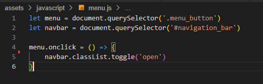

# Infraestructura y Senalizacion
Infraestructura y Señalización is an actual engineering services company based in Colombia. The company specializes in providing comprehensive road signage services, which encompass a range of activities such as road painting, vertical signage installation, and installation of road safety devices.  

The intent of the website is ncrease the company's exposure to potential clients and establish a strong online presence, ultimately expanding its reach and attracting new business opportunities.

The Infrastructura y Senalizacion website is live, to access it click [here](https://juanovt10.github.io/seprocivilCO/).

## Table of Content

+ [UX](#ux)
+ [Design](#design)
+ [Features](#features)
+ [Testing](#testing)
+ [Technologies Used](#technologies_used)
+ [Deployment](#deployment)
+ [Credits](#credits)

## UX

### Site Purpose 

To provide information about the road signage company to people interested in their consulting or engineering services. 

### Site Goal: 
To provide information about who is the company, including the general information about the company, the services it provides and a gallery of pictures showcasting their work. Additionally, it provides contact information and a form to request a quote or information from the company. 

### Audience: 
The site is design for individuals or businesses that need any sort of horizontal and vertical demarcation, road installations and XXXX. 

### Current User Goals: 
Keeping up to date with new information posted on the website

### New User Goals: 
- Ability to get a general understanding of the company background, services and projects
- Contact the company by sending a set form or by using the contact details displayed in the website
- Visit the company's social media 

## Design 

### Color Scheme: 
The color scheme of the website was deliberately selected to create a monochrome aesthetic. The primary colors chosen were razing black for the body and azure for the background. In order to enhance contrast within different sections of the website pages, these colors were inverted. For the header, a dark red shade was employed to create contrast against a lighter background, while the footer utilized Egyptian blue to contrast with a darker background. This careful selection of colors contributed to a visually appealing and cohesive design throughout the website.

### Typography: 
The body of the elements on the website utilized the font Lato, while the headings were complemented by Roboto. This careful selection of fonts enhances the professional appearance of the engineering site.

### Imagery:
All images on the website, except for the hero image and background images specifically used on the contactus.html and contactus_sent.html pages, were sourced directly from the company. The hero image, on the other hand, was obtained from a free stock photo platform.

## Features

### Exisiting features 
#### Navigation bar
The website maintains a consistent and fixed navigation bar across all pages, including the landing form page. Users can access the menu at any time, even after form submission, allowing them to continue exploring the site. The active page is highlighted in the navigation bar, aiding users in easily identifying their current location and facilitating smooth navigation.

In addition, I developed a basic hamburger menu dropdown for screen widths of 768px or less, giving credit to Code Institute, online forums, and online tutorials in the credits section. This improves the website's usability on smaller devices and ensures smooth navigation.

#### Home Page
This serves as a concise introduction page for all other sections of the website. Here, you will discover an About Us section that provides a brief description of the company along with an overview of the services it offers.

Upon scrolling, you will encounter the three primary types of services offered by the company. Notably, a hovering feature is implemented, allowing users to hover over each service to gain insight into its nature and encouraging engagement by clicking to explore the main services page.

The final section of the home page features an introductory gallery with three main pictures, each indicating the city where the corresponding project took place. These interactive pictures serve as clickable links, redirecting users to the main gallery page where they can explore the complete collection of project galleries.

The footer element for larger screens provides a short version of the main menu in the left corner, links to social media in the center and the company's logo on the right corner to go back to the index page. 

Regarding the responsive design of the footer, the additional menu is hidden for screen widths of 979px or less. Furthermore, for screen widths of 650px or less, the company logo is also not displayed. This leaves only the social media links at the center of the footer, providing a streamlined layout for smartphones and smaller devices.

#### About Us Page

This page serves as a comprehensive overview of the company, highlighting its origins, headquarters location, and the range of services it offers. It provides essential details about the company's birthplace, headquarters, and an overview of the services available. 

Within this page, you will find a mission and vision statement that clearly articulates the purpose and guiding principles of the company.

The "About Us" section also includes a dedicated values section, showcasing the company's core values. These values are defined and emphasized through the inclusion of logos, highlighting their significance and importance to the company's ethos.

#### Services Page
This page provides detailed information about the company's services, with each section featuring a title, highlighted text, and a few paragraphs of content. Users can easily request a quote or seek additional information about the company or a specific service by clicking the designated button within each section.

#### Gallery Page
The purpose of this page is to showcase the company's portfolio of work. It provides a brief description of the project locations. Given the extensive number of projects undertaken by the company, there is a link to the contact page for obtaining specific information about individual projects.

The subsequent section consists solely of a series of pictures showcasing the company's activities and projects.

#### Contact Page
Lastly, the contact page features a form on the right-hand side that allows users to provide the following information:
- First Name
- Last Name
- Email
- Phone Number
- Project location
- Interested service (as a dropdown)
- Information requested about a quote or the company. 

Furthermore, this section incorporates the contact information of the company, facilitating direct communication between users and the company for any inquiries or communication requirements.

#### Form Sent page
This page follows the same layout as the contact page, but it serves solely to provide feedback to the user, acknowledging the receipt of the form submission. 

### Future features
As previously mentioned in this document, this project represents a prototype website for an actual company based in Colombia. As a result, there are specific features and enhancements that are planned to be implemented by the company over the next six months.

- Enhancements to the dropdown navigation menu to align with best practices and improve user experience.
- Transformation of the gallery page into a dedicated projects page, featuring individual pages for each project.
- Introduction of a downloads page, enabling users to access and download technical information about the company, road standards, and other relevant documentation. 
- Addition of a WhatsApp link, providing users with quick access to send inquiries directly to the company.

## Testing
The positioning of elements has been the most challenging aspect of this project. To address this, the use of flexbox has been crucial in positioning elements across all pages of the website. In order to ensure responsiveness without distorting the images, I employed viewport units to maintain their proportions effectively. This approach helped overcome the issues encountered and maintain a visually appealing and responsive design throughout the website.

To achieve the gallery display, I utilized flexbox and resized the images accordingly. All the images were standardized to a size of 350x350px, ensuring a consistent and visually appealing image display. This approach allowed for a cohesive and uniform presentation of the gallery images.

Another challenge I encountered was implementing an industry-standard "hamburger" menu for smaller viewports. After conducting extensive research on JavaScript dropdown menus, I arrived at the following solution:

By delving into the Code Institute topics of variables in JavaScript and Python and utilizing the document.querySelector method, I defined specific classes as JavaScript variables to introduce dynamic functionality.

Next, by combining these variables with CSS, I implemented a toggle system that allows for the opening and closing of the menu. This combination of JavaScript and CSS enables seamless interaction with the menu, providing a smooth user experience.

The project faced challenges in positioning form input items effectively. To address this, I grouped each label with its corresponding input element in individual div containers and utilized flexbox to arrange them. The form layout was further enhanced by implementing a max-width property, resulting in two adaptable layouts based on available space. This approach achieved a visually pleasing and responsive form design, elevating the overall user experience.

### Validatior testing 

- All html files pass through the [W3C validator](https://jigsaw.w3.org/css-validator/#validate_by_input) with no issues. 
- All CSS files pass through the [Jigsaw Validator](https://jigsaw.w3.org/css-validator/#validate_by_input) with no issues. 
- Tested the site opens in Chrome, Safari and Mozilla. 
- No broken links

### Unfixed bugs
Additionally, it is worth noting that the website encountered an unfixed bug, which was unrelated to the code itself but rather caused by the hosting service. This bug prevented the execution of the JavaScript code, resulting in the unavailability of the dropdown menu and Font Awesome logos. The error message indicated was: "Cross-Origin Request Blocked: The Same Origin Policy disallows reading the remote resource at https://kit.fontawesome.com/3156a2e938.js. (Reason: CORS header ‘Access-Control-Allow-Origin’ missing). Status code: 530."

## Technologies used
### Programming langauges used 
- HTML5
- CSS
- JavaScript

### Frameworks, Libraries & Programs used
- Google Fonts - for the font families: Roboto and Lato. San-serif was used as a default font.
- Font Awesome - to add icons for the home services section, about us values section and the social media links in the footer.
- GitPod/CodeAnywhere - to creat my html files & styling sheet before pushing the project to Github.
- GitHub - to store my repository for submission.
- Am I Responsive? - to ensure the project looked good across all devices.

### Deployment 
The site was deployed to GitHub pages. The steps to deploy are as follows:

- In the GitHub repository, navigate to the Settings tab
- On the left hand side menu, navigate to the pages tab user code and automation.
- In build and deplyment, under branch, select the main Branch
- Once the main branch has been selected, the page will be automatically refreshed with a detailed ribbon display to indicate the successful deployment.
- The live link can be found [here - Infrastructura y Senalizacion](https://juanovt10.github.io/seprocivilCO/). 

## Credits
### Content

The company provided all the information regarding the content information. The design was inspired by various type of engineering websites of multinational companies, including: 

- [Arup](https://www.arup.com/)
- [AECOM](https://aecom.com/)
- [eyrise B.V.](https://www.eyrise.com/)
- [Henstaff Construction](https://www.henstaff.co.uk/)

### Code 

From the very beginning, my mentor Martina Terlevic advised me to utilize flexbox for element positioning. However, as I encountered challenges in this area, I sought further guidance. I found the [flexfrog tutorial](https://flexboxfroggy.com/) and [flexbox guide](https://css-tricks.com/snippets/css/a-guide-to-flexbox/), which proved invaluable in helping me understand the workings of flexbox, its various applications, and any limitations it may have. These resources provided me with the necessary knowledge and skills to overcome my struggles and effectively utilize flexbox for optimal element positioning.

The standout feature of the project is the implementation of the "hamburger" menu. This menu type is well-suited for smaller devices due to best practices and a large navigation bar. To accomplish this, I referred to the full stack development lessons on [Code Institude](https://codeinstitute.net/global/) to grasp the principles of variables in JavaScript and learn how to transform HTML ids and classes into JavaScript variables. The resources utilized for this purpose were:

- [W3C schools](https://www.w3schools.com/jsref/met_document_queryselector.asp) 
- [Tahmid Ahmed youtube tutorial](https://www.youtube.com/watch?v=VRrEquQfh88)

Furthermore, I drew inspiration for form styling and interaction from the following source:
- [CodingLab](https://www.youtube.com/watch?v=okbByPWS1Xc)

### Media
The hero image was the only image taken from a free stock page: 
- [Road avenue with adjacent trees from Pixabay](https://pixabay.com/photos/asphalt-street-trees-avenue-2178703/)

The rest of the picture where provided directly from the existing company in Colombia. The contact details are the follwoing: 
- Eduardo Velasquez
- eaduardoantoniovelasquezv@gmail.com

